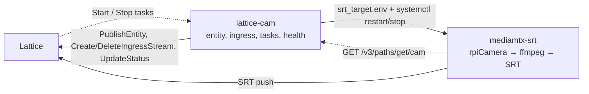

# lattice-cam

This sample app demonstrates a Raspberry Pi integration with Lattice using the Lattice SDK for Python gRPC (Connect).
The camera is represented in Lattice as a stationary asset with an electro-optical (EO) sensor, a live [SRT](https://www.haivision.com/products/srt-secure-reliable-transport/) video, real-time health reporting, and support for two custom [Lattice tasks](https://developer.anduril.com/guides/tasks/overview), `Start` and `Stop`.

The app is comprised of two systemd units that run on the Pi:

1. A Python daemon publishes the entity at 1 Hz, registers the SRT ingress, listens for tasks as a Lattice agent, samples
    health, and handles tasking of the camera.
2. A MediaMTX daemon, which captures the Pi camera and pushes H.264 over SRT to the ingress endpoint it receives from Lattice.

For more information about the Lattice SDK, see the [Lattice SDK documentation](https://developer.anduril.com/).
To apply as an organization for access to the Lattice Developer Experience, see the [developer dashboard](https://dashboard.developer.anduril.com/).



## Layout

```
src/lattice_cam/
  main.py        app wiring 
  config.py      validation and .env parsing
  state.py       JSON state: ingress record, created_time
  runtime.py     handles 1 Hz publish loop, workers, and offline publish at shutdown
  lattice/       transport, auth, one thin client per API
  entity/        base entity + one contributor per component
  camera/        pipeline (MediaMTX commands + status probe), Start/Stop control, ingress
  tasking/       ListenAsAgent stream, dispatch, and status lifecycle
  health/        handles probes, to sampler worker, to snapshot, and finally Health contributor workflow
task-def/        Start/Stop protobuf definitions (Buf module for the Lattice  Schema Registry)
deploy/          systemd unit templates and the sudoers 
scripts/         installation and test scripts
tests/           mocked unit tests configured per package
```

## Hardware requirements

This integration has been validated on the following hardware:

- [Raspberry Pi 5](https://www.raspberrypi.com/products/raspberry-pi-5/)
- [Camera Module 3](https://www.raspberrypi.com/products/camera-module-3/) with a 12-megapixel Sony IMX708 image sensor

The camera connects to the Pi over the CSI ribbon cable and must be enabled in
the Pi's camera stack — `rpicam-hello` should produce a preview before you run
this integration.

Other Raspberry Pi boards and libcamera-compatible camera
modules are likely to work but are untested. For more infomration on setting up your Raspberry Pi, see the
[official documentation](https://www.raspberrypi.com/documentation/computers/camera_software.html).

## Before you begin

Ensure you have [set up your development environment](https://developer.anduril.com/guides/getting-started/set-up).

## Setup

```bash
make install                   # creates .venv with the pinned SDK and dev tools
cp .env.example .env           # every key is documented there; set the camera position
./scripts/install-mediamtx.sh  # on the Pi: fetch the MediaMTX binary
```

Configurations are set in `.env`. Malformed value fail at startup, rather than falling back
to a default. `TASK_START_COMMAND` and `TASK_STOP_COMMAND` must match the
`sudoers` rule that you set.

## Tasking

This integration uses two tasks, defined in the Lattice Schema Registry (LSR):
- [Start](https://schema-registry.developer.anduril.com/anduril/sample-app-camera/docs/main%3Aanduril.sample_app_camera.camera.v1alpha#anduril.sample_app_camera.camera.v1alpha.Start): Runs the MediaMTX daemon that pushes video to the Lattice SRT endpoint. 
- [Stop](https://schema-registry.developer.anduril.com/anduril/sample-app-camera/docs/main%3Aanduril.sample_app_camera.camera.v1alpha#anduril.sample_app_camera.camera.v1alpha.Stop): Stops the daemon, deletes the ingress stream in Lattice, and clears the entity media items list.
    
If you [create your own custom tasks](https://developer.anduril.com/guides/tasks/define-a-task) to use with this app,
push the new task definitions once:

1. Run `export BUF_TOKEN=<token>@schema-registry.developer.anduril.com`.
2. Run `cd task-def && buf lint && buf build && buf push`.

## Run and verify

To run and verify the app, do the following:

```bash
.venv/bin/lattice-cam --config .env                      # or the systemd unit
.venv/bin/python scripts/verify.py --config .env         # read the entity back: media, sensor, catalog, health
.venv/bin/python scripts/send_task.py --config .env Stop  # SENT -> EXECUTING -> DONE_OK; then Start
make check                                                # ruff, mypy, pytest
```

## Deploy

The files under `deploy/` are templates. `make install-units` renders
`@INSTALL_DIR@` and `@SERVICE_USER@`, validates the sudoers rule, installs both units,
and reloads systemd.

```bash
make install-units [SERVICE_USER=rpi-cam INSTALL_DIR=/opt/lattice-cam]
sudo systemctl enable --now lattice-cam
journalctl -u lattice-cam -u mediamtx-srt -f
```

## Upgrade

On a Pi that already runs the integration, pull the new version and:

```bash
make install                                       # rebuild .venv against the pinned SDK
make install-units                                 # re-render and install units + sudoers rule
sudo systemctl restart lattice-cam                 # stops MediaMTX, archives the ingress, starts fresh
.venv/bin/python scripts/verify.py --config .env   # confirm the entity reads back as expected
```

The service persists its state in `state.json`, so an ingress endpoint left by
the old process is archived at startup.

## License

This project is licensed under the terms of the [Anduril Lattice SDK License Agreement](LICENSE.md).

